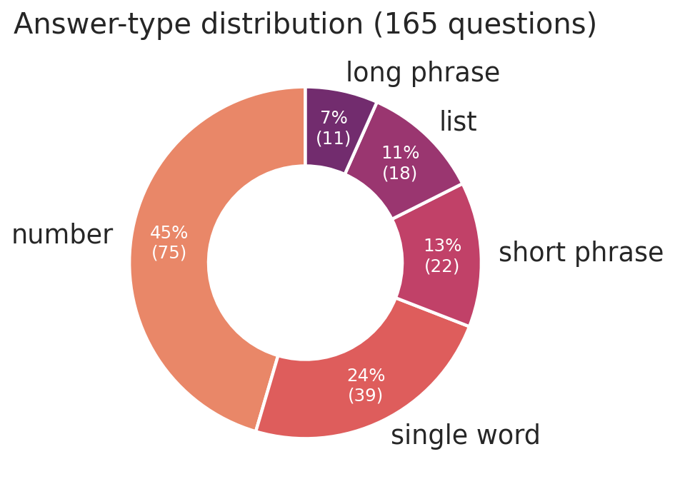
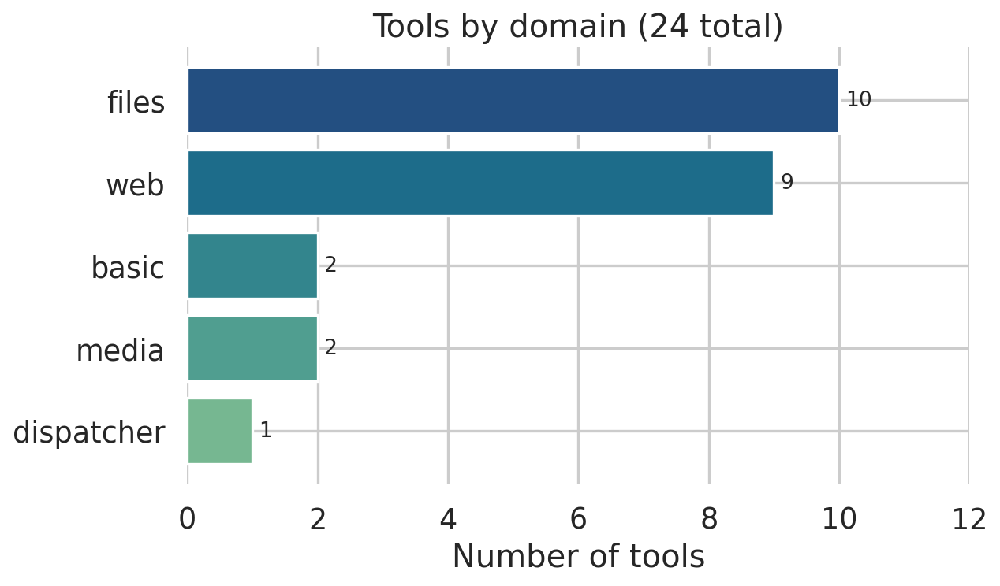

[**Source on GitHub →**](https://github.com/patelis/gaia){.btn .btn-primary}

[GAIA](https://huggingface.co/papers/2311.12983) is a benchmark designed to embarrass autonomous agents: each question is conceptually simple for a careful human, but demands multi-step reasoning, the right tool at the right moment, and tolerance for inputs that arrive as PDFs, spreadsheets, audio clips, images, or arbitrary web pages. I built this project as the Unit 4 capstone of [Hugging Face's AI Agents Course](https://huggingface.co/learn/agents-course/) — a self-contained agent that ingests a GAIA task, decides what it needs, fetches files, reasons over them with the appropriate tools, and emits an answer in the exact string form GAIA's grader expects.

## Architecture — a five-node LangGraph state machine

The agent is built on **LangGraph**, with each step modelled as a node and the conversation state passed between them as a typed dict. The graph is roughly a plan → execute → observe → refine loop, with retrieval and answer-formatting bookending it:

{fig-alt="Detailed LangGraph diagram showing the five agent nodes, the tool-execution sub-graph attached to the processor, and the final formatter node."}

-   **File Downloader Node** — pulls any files associated with the current task from the GAIA API and caches them locally so downstream nodes can read them without network round-trips.
-   **Retriever Node** — performs **hybrid retrieval** over a local corpus of 165 GAIA training questions. Supabase backs a dense vector store (using `gte-modernbert-base` embeddings); `bm25s` provides the lexical lane. The two ranked lists are merged with **Reciprocal Rank Fusion** — a parameter-free fusion method that punches above its weight.
-   **Reranker Node** — a ModernBERT cross-encoder rescores the fused candidates, and the top-K survivors are injected into the processor's prompt as **few-shot demonstrations** of how to approach similar questions.
-   **Processor Node** — the main solver. Calls Qwen3-32B via the Hugging Face Inference API, with the full tool catalogue bound. This node loops: think, pick a tool, observe its result, decide whether more work is needed. The recursion limit is configurable, so the agent doesn't spin forever on adversarial tasks.
-   **Formatter Node** — a second, *deliberately constrained* LLM call. It's bound to exactly one tool, `emit_final_answer`, which forces the model to emit its answer through a strict JSON schema rather than via free text.

## Why two stages instead of one

GAIA grades answers via exact-string match. "Paris", "paris", and "The answer is Paris." are three different things to the grader. A single LLM trying to *both* reason *and* respect the answer contract fails the second job more often than you'd like — and patching that with regex post-processing creates a fragile cliff every time a model varies its phrasing.

{fig-alt="Donut chart of answer-type distribution across 165 GAIA training questions: number 45%, single word 24%, short phrase 13%, list 11%, long phrase 7%." width="70%"}

Splitting the responsibilities is liberating. The processor reasons in whatever shape works best — chains of thought, partial calculations, tool-call traces, half-formed hypotheses. Then a dedicated formatter, told *one thing only* and bound to *one tool only*, ratchets the final answer into the exact format GAIA wants. The cost is one extra LLM call per task; the benefit is that the contract is now enforced by the tool schema, not by hope.

## Why hybrid retrieval

Dense embeddings catch semantic neighbours: questions that aren't worded the same but are *about* the same thing. BM25 catches the literal-keyword cases — proper nouns, code identifiers, exact phrases — where embeddings systematically underperform. Vector-only retrieval reliably misses "find the function `compute_eigvals` in this file"; BM25-only misses "what's the boiling point of mercury" when the corpus uses different vocabulary. Fusing them with RRF gives you both lanes without a hyperparameter sweep, and the cross-encoder reranker is the final quality pass before the few-shot slot — important because the corpus is only 165 questions, so prompt real estate is precious and quality matters more than quantity.

{fig-alt="Four-panel bar chart comparing BM25 top-5, vector top-10, RRF top-5, and reranker top-3 for a sample question, showing the same document ranked first across all stages."}

## Tools and modalities

{fig-alt="Horizontal bar chart of tool count by domain: files 10, web 9, basic 2, media 2, dispatcher 1." width="75%"}

The agent reaches across every modality GAIA throws at it:

-   **Text & web** — DuckDuckGo and Tavily for search, Wikipedia and arXiv for canonical sources, `trafilatura` for clean web-page extraction, the YouTube transcript API for video questions.
-   **Files** — `pypdf` for PDFs, `python-docx` / `python-pptx` / `openpyxl` for the Office stack, `polars` for tabular data, `biopython` for `.pdb` molecular files, ZIP traversal for archives.
-   **Media** — Qwen3-VL-32B-Instruct as the vision-language model for image questions; Whisper-large-v3 for audio transcription.
-   **Compute** — a sandboxed Python `eval` tool and a calculator for arithmetic-heavy questions where letting the LLM "do the math in its head" is a known failure mode.
-   **Dispatcher** — instead of binding twenty file-specific tools to the LLM, a single dispatcher tool routes by file extension to the right handler. This keeps the visible tool list short, which keeps tool-calling reliable.

## Tech stack

| Layer | Stack |
|------------------------------------|------------------------------------|
| Orchestration | LangGraph, LangChain |
| LLM / VLM / ASR | Hugging Face Inference API — Qwen3-32B, Qwen3-VL-32B-Instruct, Whisper-large-v3 |
| Retrieval | Supabase (vector store), `sentence-transformers`, `bm25s`, ModernBERT cross-encoder |
| Documents | pypdf, python-docx, python-pptx, openpyxl |
| Data / science | polars, biopython, pillow, librosa, soundfile |
| Web | ddgs, tavily-python, wikipedia, arxiv, trafilatura, youtube-transcript-api |
| UI | Gradio |
| Config | YAML — every model ID, retrieval depth, and recursion limit lives in `config.yaml`, not in code |

## Status on the Agents Course set

On the GAIA subset used by the Hugging Face Agents Course, the agent answers every question that the scoring API will currently evaluate. The remaining four — a chess image, an audio recipe clip, a Python script, and a fast-food sales spreadsheet — depend on files served via `GET /files/{task_id}`, which is presently returning `404 "No file path associated with task_id …"` for every file-bearing task in the round (tracked in [huggingface/agents-course#624](https://github.com/huggingface/agents-course/issues/624)). The agent handles the failure gracefully: it calls `retry_file_download` once and then emits `FINAL ANSWER: unknown` rather than fabricate. Those four become evaluable again as soon as the API serves the underlying files.

## What I'd do next

A few honest notes from building this:

-   **Run it against the full GAIA validation set.** The Agents Course subset is a slice of the broader benchmark; pointing the same graph at the full validation set is the obvious next step to see whether the architectural choices (two-stage formatter, hybrid retrieval, dispatcher) hold up at scale.
-   **Cost.** The dual-LLM design (reasoning + formatter) doubles token spend. For a benchmark, the reliability win is worth it; in production you'd want to A/B that decision against a single well-prompted call with structured output.
-   **The corpus is the ceiling.** Retrieval quality is bounded by the 165 training-set questions. Expanding the corpus — even with synthesised examples — would compound the few-shot effect linearly with very little engineering work.
-   **The dispatcher pattern generalises.** Routing-by-extension is a clean way to keep the agent's visible tool count low even as the underlying file-format support grows. I'd reach for it again in any multi-modal agent.

## Try it

-   **Repo:** <https://github.com/patelis/gaia>
-   **Course:** [Hugging Face AI Agents Course](https://huggingface.co/learn/agents-course/unit0/introduction) — the capstone challenge that produced this project
-   **Keywords:** LangGraph, LangChain, Qwen3, ModernBERT, Whisper, Supabase, BM25, RRF, Gradio